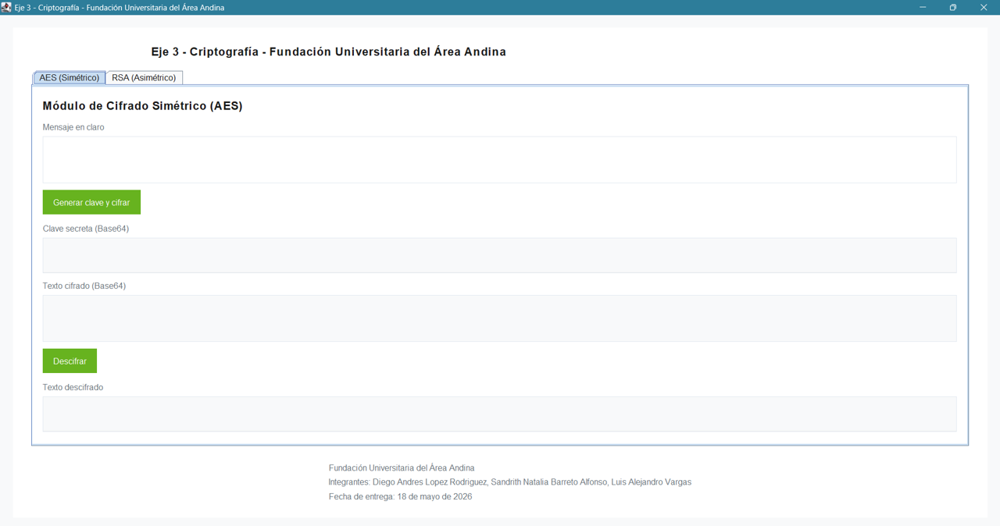
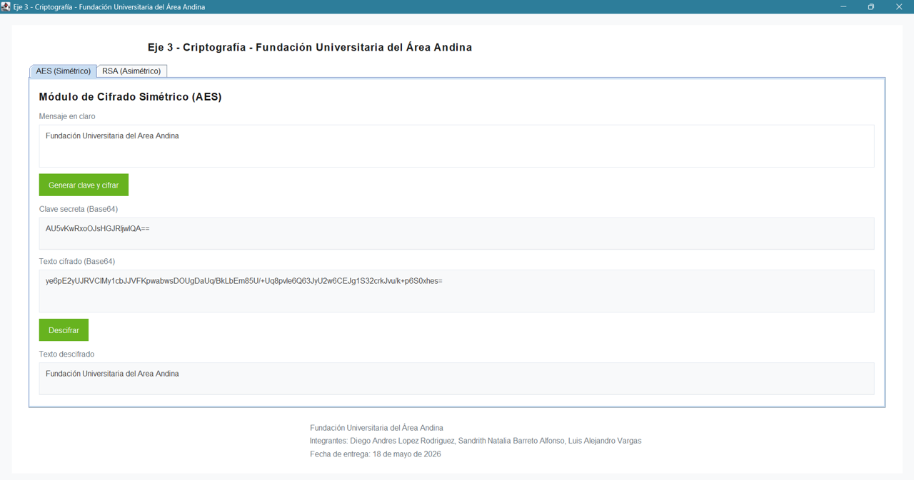
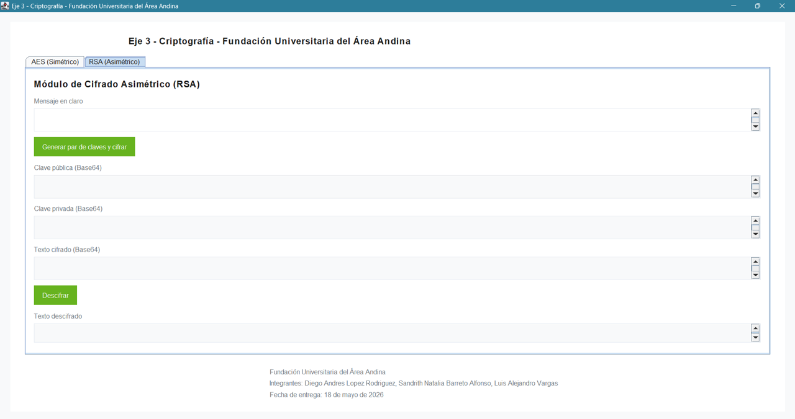
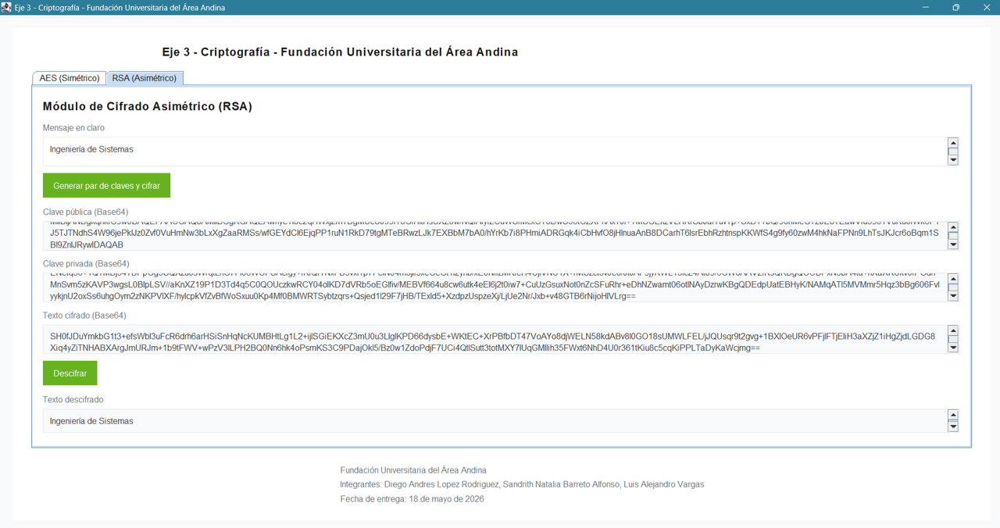

# Eje 3 - Criptografia | Fundación Universitaria del Area Andina

## Integrantes

| Nombre | Rol |
|--------|-----|
| Diego Andrés Lopez Rodriguez | Desarrollador |
| Sandrith Natalia Barreto Alfonso | Desarrolladora |
| Luis Alejandro Vargas | Desarrollador |

---

## Descripcion

Aplicación Java con interfaz gráfica moderna en Swing que implementa dos módulos de criptografía:

- **AES (Simétrico):** cifrado con modo GCM, clave de 128 bits e IV aleatorio de 12 bytes.
- **RSA (Asimétrico):** generación de par de claves de 2048 bits con padding PKCS#1.

Toda la entrada y salida de claves y textos cifrados se representa en **Base64** para facilitar su visualización y transporte.

---

## Requisitos

- JDK 8 o superior
- No requiere dependencias externas; usa únicamente la biblioteca estándar de Java (`javax.crypto`, `java.security`)

---

## Estructura del proyecto

```
proyecto-criptografia/
├── src/
│   ├── FormularioCriptografia.java   # Clase principal: UI + lógica criptográfica
│   ├── Main.java                     # Plantilla generada por el IDE (no utilizada)
│   └── resources/
│       ├── captura-1.png
│       ├── captura-2.png
│       ├── captura-3.png
│       └── captura-4.png
├── out/
│   └── FormularioCriptografia.class  # Clase compilada
└── README.md
```

---

## Compilacion y ejecucion

```powershell
javac -d out src\FormularioCriptografia.java
java -cp out FormularioCriptografia
```

---

## Modulo AES (Simetrico)

### Parametros técnicos

| Parámetro | Valor |
|-----------|-------|
| Algoritmo | AES |
| Modo | GCM (Galois/Counter Mode) |
| Padding | NoPadding |
| Tamaño de clave | 128 bits |
| Longitud IV | 12 bytes |
| Tag GCM | 128 bits |

### Flujo de operacion

```
Mensaje en texto plano
        │
        ▼
  Generar clave AES (128 bits, SecureRandom)
  Generar IV aleatorio (12 bytes)
        │
        ▼
  AES/GCM/NoPadding → texto cifrado
        │
        ▼
  Concatenar [IV (12 bytes)] + [cifrado]
        │
        ▼
  Codificar en Base64 → salida en pantalla
```

**Descifrado:** se decodifica el Base64, se extraen los primeros 12 bytes como IV y el resto como texto cifrado; luego se descifra con la clave almacenada.

---

## Modulo RSA (Asimetrico)

### Parametros técnicos

| Parámetro | Valor |
|-----------|-------|
| Algoritmo | RSA |
| Modo | ECB |
| Padding | PKCS1Padding |
| Tamaño de clave | 2048 bits |
| Formato clave privada | PKCS#8 |

### Flujo de operacion

```
Mensaje en texto plano
        │
        ▼
  Generar par de claves RSA (2048 bits, SecureRandom)
        │
        ├──► Clave pública  → cifrar mensaje
        │         │
        │         ▼
        │    RSA/ECB/PKCS1Padding → texto cifrado en Base64
        │
        └──► Clave privada (Base64) → almacenada para descifrado
```

**Descifrado:** se reconstruye la clave privada desde Base64 usando `PKCS8EncodedKeySpec` y se descifra el mensaje.

---

## Capturas

| Ventana principal | Modulo AES |
|:-----------------:|:----------:|
|  |  |

| Cifrado RSA | Descifrado RSA |
|:-----------:|:--------------:|
|  |  |

---

## Notas tecnicas

- **AES/GCM** proporciona cifrado autenticado (confidencialidad + integridad) sin necesidad de un MAC separado.
- El IV se genera con `SecureRandom` en cada operación de cifrado para garantizar que nunca se reutilice con la misma clave.
- **RSA/ECB/PKCS1Padding** cifra bloque a bloque; para mensajes largos en producción se recomienda cifrado híbrido (RSA cifra la clave AES).
- La interfaz detecta la fuente **Roboto** si está instalada en el sistema; de lo contrario usa **SansSerif** como alternativa.
- Fecha de entrega: **18 de mayo de 2026**
